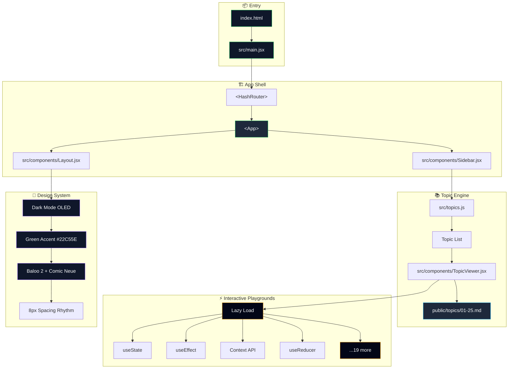
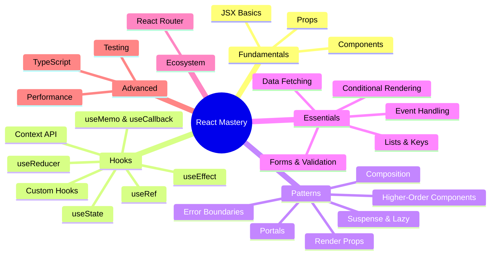

<p align="center">
  <picture>
    <source media="(prefers-color-scheme: dark)" srcset="data:image/svg+xml,%3Csvg xmlns%3D%22http%3A%2F%2Fwww.w3.org%2F2000%2Fsvg%22 viewBox%3D%220 0 800 200%22%3E%3Cdefs%3E%3ClinearGradient id%3D%22g%22 x1%3D%220%25%22 y1%3D%220%25%22 x2%3D%22100%25%22 y2%3D%22100%25%22%3E%3Cstop offset%3D%220%25%22 stop-color%3D%22%2322C55E%22%2F%3E%3Cstop offset%3D%22100%25%22 stop-color%3D%22%230EA5E9%22%2F%3E%3C%2FlinearGradient%3E%3Cfilter id%3D%22glow%22%3E%3CfeGaussianBlur stdDeviation%3D%223%22 result%3D%22coloredBlur%22%2F%3E%3CfeMerge%3E%3CfeMergeNode in%3D%22coloredBlur%22%2F%3E%3CfeMergeNode in%3D%22SourceGraphic%22%2F%3E%3C%2FfeMerge%3E%3C%2Ffilter%3E%3C%2Fdefs%3E%3Ctext x%3D%22400%22 y%3D%2290%22 font-family%3D%22system-ui%2C sans-serif%22 font-size%3D%2260%22 font-weight%3D%22800%22 fill%3D%22url(%23g)%22 text-anchor%3D%22middle%22 filter%3D%22url(%23glow)%22%3E%E2%9A%9B%EF%B8%8F React Mastery%3C%2Ftext%3E%3Ctext x%3D%22400%22 y%3D%22135%22 font-family%3D%22system-ui%2C sans-serif%22 font-size%3D%2218%22 fill%3D%22%2394A3B8%22 text-anchor%3D%22middle%22%3EInteractive React Learning Playground — 25 Topics %26middot%3B 23 Live Playgrounds%3C%2Ftext%3E%3Ccircle cx%3D%22200%22 cy%3D%22170%22 r%3D%223%22 fill%3D%22%2322C55E%22%3E%3Canimate attributeName%3D%22opacity%22 values%3D%221%3B0%3B1%22 dur%3D%222s%22 repeatCount%3D%22indefinite%22%2F%3E%3C%2Fcircle%3E%3Ccircle cx%3D%22600%22 cy%3D%22170%22 r%3D%223%22 fill%3D%22%230EA5E9%22%3E%3Canimate attributeName%3D%22opacity%22 values%3D%221%3B0%3B1%22 dur%3D%222.5s%22 repeatCount%3D%22indefinite%22%2F%3E%3C%2Fcircle%3E%3Ccircle cx%3D%22150%22 cy%3D%2240%22 r%3D%222%22 fill%3D%22%23F8FAFC%22%3E%3Canimate attributeName%3D%22opacity%22 values%3D%220%3B1%3B0%22 dur%3D%223s%22 repeatCount%3D%22indefinite%22%2F%3E%3C%2Fcircle%3E%3Ccircle cx%3D%22650%22 cy%3D%2250%22 r%3D%222%22 fill%3D%22%23F8FAFC%22%3E%3Canimate attributeName%3D%22opacity%22 values%3D%220%3B1%3B0%22 dur%3D%224s%22 repeatCount%3D%22indefinite%22%2F%3E%3C%2Fcircle%3E%3Ccircle cx%3D%22100%22 cy%3D%22100%22 r%3D%221.5%22 fill%3D%22%23F8FAFC%22%3E%3Canimate attributeName%3D%22opacity%22 values%3D%221%3B0%3B1%22 dur%3D%225s%22 repeatCount%3D%22indefinite%22%2F%3E%3C%2Fcircle%3E%3Ccircle cx%3D%22700%22 cy%3D%22140%22 r%3D%221.5%22 fill%3D%22%23F8FAFC%22%3E%3Canimate attributeName%3D%22opacity%22 values%3D%220%3B1%3B0%22 dur%3D%223.5s%22 repeatCount%3D%22indefinite%22%2F%3E%3C%2Fcircle%3E%3C%2Fsvg%3E">
  </picture>
</p>

<p align="center">
  <!-- Animated React Atom -->
  
</p>

<p align="center">
  <a href="https://react.dev"></a>
  <a href="https://vitejs.dev"></a>
  <a href="https://reactrouter.com"></a>
  <a href="https://github.com/deb888/react-mastery"></a>
  <a href="https://github.com/deb888/react-mastery/blob/main/LICENSE"></a>
</p>

---

## Architecture Flow



---

## Topic Map



---

## Learning Path

```mermaid
flowchart LR
    subgraph Phase1["Phase 1: Core"]
        A["01 JSX"] --> B["02 Components"]
        B --> C["03 Props"]
        C --> D["04 useState"]
        D --> E["05 useEffect"]
    end

    subgraph Phase2["Phase 2: Deepen"]
        E --> F["06 Context"]
        F --> G["07 useReducer"]
        G --> H["08 useRef"]
        H --> I["09 useMemo"]
        I --> J["10 Custom Hooks"]
    end

    subgraph Phase3["Phase 3: Patterns"]
        J --> K["11 HOC"]
        K --> L["12 Render Props"]
        L --> M["13 Error Boundaries"]
        M --> N["14 Suspense"]
        N --> O["15 Portals"]
        O --> P["20 Composition"]
    end

    subgraph Phase4["Phase 4: Real World"]
        E --> Q["16 Forms"]
        Q --> R["17 Lists & Keys"]
        R --> S["18 Events"]
        S --> T["19 Conditional"]
        T --> U["21 Data Fetching"]
        U --> V["22 Router"]
    end

    subgraph Phase5["Phase 5: Polish"]
        V --> W["23 Performance"]
        W --> X["24 Testing"]
        X --> Y["25 TypeScript"]
    end

    style Phase1 fill:#1E293B,stroke:#22C55E,color:#F8FAFC
    style Phase2 fill:#1E293B,stroke:#0EA5E9,color:#F8FAFC
    style Phase3 fill:#1E293B,stroke:#F59E0B,color:#F8FAFC
    style Phase4 fill:#1E293B,stroke:#8B5CF6,color:#F8FAFC
    style Phase5 fill:#1E293B,stroke:#EF4444,color:#F8FAFC
```



---

## Quick Start

```bash
# Clone
git clone https://github.com/deb888/react-mastery.git
cd react-mastery

# Install
npm install

# Dev server (port 3000)
npm run dev

# Production build
npm run build
npm run preview
```

---

## Stack

| Layer | Technology |
|-------|-----------|
| **Runtime** | React 18 |
| **Bundler** | Vite 5 |
| **Routing** | React Router 6 |
| **Code Split** | React.lazy + Suspense |
| **Styling** | CSS Variables + Dark Mode |
| **Icons** | Inline SVG |
| **Fonts** | Baloo 2 / Comic Neue (Google Fonts) |

---

## Project Structure

```
react-mastery/
├── index.html              # Entry point
├── package.json            # Dependencies
├── vite.config.js          # Vite configuration
├── public/
│   └── topics/             # 25 MD topic guides
│       ├── 01-jsx-basics.md
│       ├── 02-components.md
│       └── ...             # 03-25
├── src/
│   ├── main.jsx            # React root
│   ├── App.jsx             # Router + Layout
│   ├── index.css           # Design tokens
│   ├── topics.js           # Topic registry
│   ├── components/
│   │   ├── Layout.jsx      # Shell + keyboard nav
│   │   ├── Sidebar.jsx     # Category sidebar
│   │   └── TopicViewer.jsx # MD renderer + lazy playground loader
│   └── playgrounds/        # 23 interactive demos
│       ├── JsxBasics.jsx
│       ├── StateDemo.jsx
│       └── ...             # 21 more
```

---

## Feature Highlights

| Feature | Details |
|---------|---------|
| **25 MD Guides** | Each topic: concept → syntax → examples → edge cases → pro tips |
| **23 Live Playgrounds** | Interactive demos per topic, lazy-loaded on demand |
| **Dark Mode OLED** | `#0F172A` background, green accent `#22C55E`, WCAG AAA |
| **Keyboard Nav** | ← → arrow keys to navigate topics, sidebar toggle |
| **Code Splitting** | Each playground is a separate chunk (avg ~2KB gzip) |
| **Responsive** | Mobile sidebar overlay, fluid layout down to 320px |
| **Accessible** | Focus rings, aria-labels, skip navigation, reduced-motion support |
| **Design Tokens** | Semantic CSS variables, 8px spacing scale, consistent type ramp |

---

<p align="center">
  
  
  
  
  
</p>

<p align="center">
  <!-- Animated Stats Counter -->
  <img src="data:image/svg+xml,%3Csvg xmlns%3D%22http%3A%2F%2Fwww.w3.org%2F2000%2Fsvg%22 width%3D%22760%22 height%3D%22120%22%3E%3Cdefs%3E%3ClinearGradient id%3D%22g1%22 x1%3D%220%22 y1%3D%220%22 x2%3D%221%22 y2%3D%220%22%3E%3Cstop offset%3D%220%25%22 stop-color%3D%22%2322C55E%22%2F%3E%3Cstop offset%3D%22100%25%22 stop-color%3D%22%2316a34a%22%2F%3E%3C%2FlinearGradient%3E%3ClinearGradient id%3D%22g2%22 x1%3D%220%22 y1%3D%220%22 x2%3D%221%22 y2%3D%220%22%3E%3Cstop offset%3D%220%25%22 stop-color%3D%22%230EA5E9%22%2F%3E%3Cstop offset%3D%22100%25%22 stop-color%3D%22%232566EB%22%2F%3E%3C%2FlinearGradient%3E%3ClinearGradient id%3D%22g3%22 x1%3D%220%22 y1%3D%220%22 x2%3D%221%22 y2%3D%220%22%3E%3Cstop offset%3D%220%25%22 stop-color%3D%22%23F59E0B%22%2F%3E%3Cstop offset%3D%22100%25%22 stop-color%3D%22%23D97706%22%2F%3E%3C%2FlinearGradient%3E%3ClinearGradient id%3D%22g4%22 x1%3D%220%22 y1%3D%220%22 x2%3D%221%22 y2%3D%220%22%3E%3Cstop offset%3D%220%25%22 stop-color%3D%22%238B5CF6%22%2F%3E%3Cstop offset%3D%22100%25%22 stop-color%3D%22%236D28D9%22%2F%3E%3C%2FlinearGradient%3E%3C%2Fdefs%3E%3Crect x%3D%225%22 y%3D%225%22 width%3D%22180%22 height%3D%22110%22 rx%3D%228%22 fill%3D%22%231E293B%22 stroke%3D%22%23334155%22%2F%3E%3Ctext x%3D%2295%22 y%3D%2235%22 text-anchor%3D%22middle%22 font-family%3D%22system-ui%22 font-size%3D%2236%22 font-weight%3D%22800%22 fill%3D%22%2322C55E%22%3E%3Canimate attributeName%3D%22opacity%22 values%3D%220%3B1%22 dur%3D%220.5s%22 fill%3D%22freeze%22%2F%3E25%3C%2Ftext%3E%3Ctext x%3D%2295%22 y%3D%2260%22 text-anchor%3D%22middle%22 font-family%3D%22system-ui%22 font-size%3D%2212%22 fill%3D%22%2394A3B8%22%3ETopics%3C%2Ftext%3E%3Crect x%3D%2220%22 y%3D%2275%22 width%3D%22150%22 height%3D%226%22 rx%3D%223%22 fill%3D%22%23272F42%22%2F%3E%3Crect x%3D%2220%22 y%3D%2275%22 width%3D%220%22 height%3D%226%22 rx%3D%223%22 fill%3D%22url(%23g1)%22%3E%3Canimate attributeName%3D%22width%22 from%3D%220%22 to%3D%22150%22 dur%3D%221.5s%22 fill%3D%22freeze%22%2F%3E%3C%2Frect%3E%3Crect x%3D%22195%22 y%3D%225%22 width%3D%22180%22 height%3D%22110%22 rx%3D%228%22 fill%3D%22%231E293B%22 stroke%3D%22%23334155%22%2F%3E%3Ctext x%3D%22285%22 y%3D%2235%22 text-anchor%3D%22middle%22 font-family%3D%22system-ui%22 font-size%3D%2236%22 font-weight%3D%22800%22 fill%3D%22%230EA5E9%22%3E%3Canimate attributeName%3D%22opacity%22 values%3D%220%3B1%22 dur%3D%220.7s%22 fill%3D%22freeze%22%2F%3E23%3C%2Ftext%3E%3Ctext x%3D%22285%22 y%3D%2260%22 text-anchor%3D%22middle%22 font-family%3D%22system-ui%22 font-size%3D%2212%22 fill%3D%22%2394A3B8%22%3EPlaygrounds%3C%2Ftext%3E%3Crect x%3D%22210%22 y%3D%2275%22 width%3D%22150%22 height%3D%226%22 rx%3D%223%22 fill%3D%22%23272F42%22%2F%3E%3Crect x%3D%22210%22 y%3D%2275%22 width%3D%220%22 height%3D%226%22 rx%3D%223%22 fill%3D%22url(%23g2)%22%3E%3Canimate attributeName%3D%22width%22 from%3D%220%22 to%3D%22138%22 dur%3D%221.5s%22 fill%3D%22freeze%22%2F%3E%3C%2Frect%3E%3Crect x%3D%22385%22 y%3D%225%22 width%3D%22180%22 height%3D%22110%22 rx%3D%228%22 fill%3D%22%231E293B%22 stroke%3D%22%23334155%22%2F%3E%3Ctext x%3D%22475%22 y%3D%2235%22 text-anchor%3D%22middle%22 font-family%3D%22system-ui%22 font-size%3D%2236%22 font-weight%3D%22800%22 fill%3D%22%23F59E0B%22%3E%3Canimate attributeName%3D%22opacity%22 values%3D%220%3B1%22 dur%3D%220.9s%22 fill%3D%22freeze%22%2F%3E6%3C%2Ftext%3E%3Ctext x%3D%22475%22 y%3D%2260%22 text-anchor%3D%22middle%22 font-family%3D%22system-ui%22 font-size%3D%2212%22 fill%3D%22%2394A3B8%22%3ECategories%3C%2Ftext%3E%3Crect x%3D%22400%22 y%3D%2275%22 width%3D%22150%22 height%3D%226%22 rx%3D%223%22 fill%3D%22%23272F42%22%2F%3E%3Crect x%3D%22400%22 y%3D%2275%22 width%3D%220%22 height%3D%226%22 rx%3D%223%22 fill%3D%22url(%23g3)%22%3E%3Canimate attributeName%3D%22width%22 from%3D%220%22 to%3D%22150%22 dur%3D%221.5s%22 fill%3D%22freeze%22%2F%3E%3C%2Frect%3E%3Crect x%3D%22575%22 y%3D%225%22 width%3D%22180%22 height%3D%22110%22 rx%3D%228%22 fill%3D%22%231E293B%22 stroke%3D%22%23334155%22%2F%3E%3Ctext x%3D%22665%22 y%3D%2235%22 text-anchor%3D%22middle%22 font-family%3D%22system-ui%22 font-size%3D%2236%22 font-weight%3D%22800%22 fill%3D%22%238B5CF6%22%3E%3Canimate attributeName%3D%22opacity%22 values%3D%220%3B1%22 dur%3D%221.1s%22 fill%3D%22freeze%22%2F%3E65%3C%2Ftext%3E%3Ctext x%3D%22665%22 y%3D%2260%22 text-anchor%3D%22middle%22 font-family%3D%22system-ui%22 font-size%3D%2212%22 fill%3D%22%2394A3B8%22%3EModules%3C%2Ftext%3E%3Crect x%3D%22590%22 y%3D%2275%22 width%3D%22150%22 height%3D%226%22 rx%3D%223%22 fill%3D%22%23272F42%22%2F%3E%3Crect x%3D%22590%22 y%3D%2275%22 width%3D%220%22 height%3D%226%22 rx%3D%223%22 fill%3D%22url(%23g4)%22%3E%3Canimate attributeName%3D%22width%22 from%3D%220%22 to%3D%22150%22 dur%3D%221.5s%22 fill%3D%22freeze%22%2F%3E%3C%2Frect%3E%3C%2Fsvg%3E" alt="Stats">
</p>

<p align="center">
  <!-- Animated Skills Coverage -->
  
</p>

<p align="center">
  <!-- Animated Terminal -->
  
</p>

<p align="center">
  <sub>Built with React 18 • Vite 5 • Dark Mode • MIT License</sub>
  <br>
  <sub>
    <a href="https://github.com/deb888/react-mastery">Repository</a> •
    <a href="https://react.dev">React Docs</a> •
    <a href="https://vitejs.dev">Vite</a>
  </sub>
</p>
